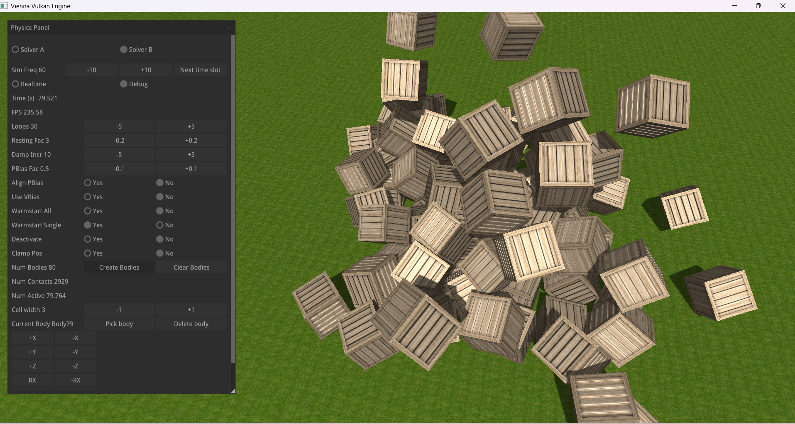
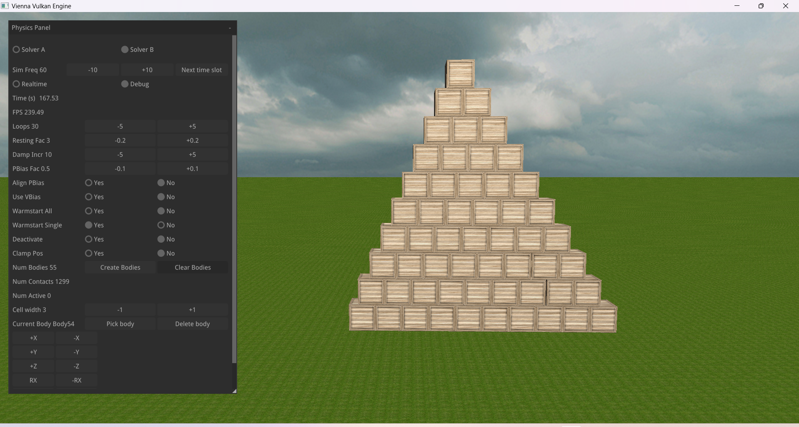
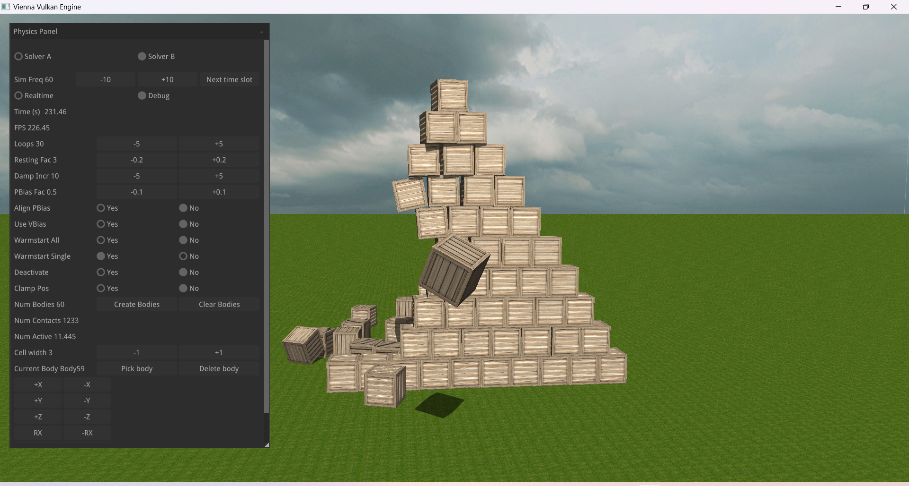
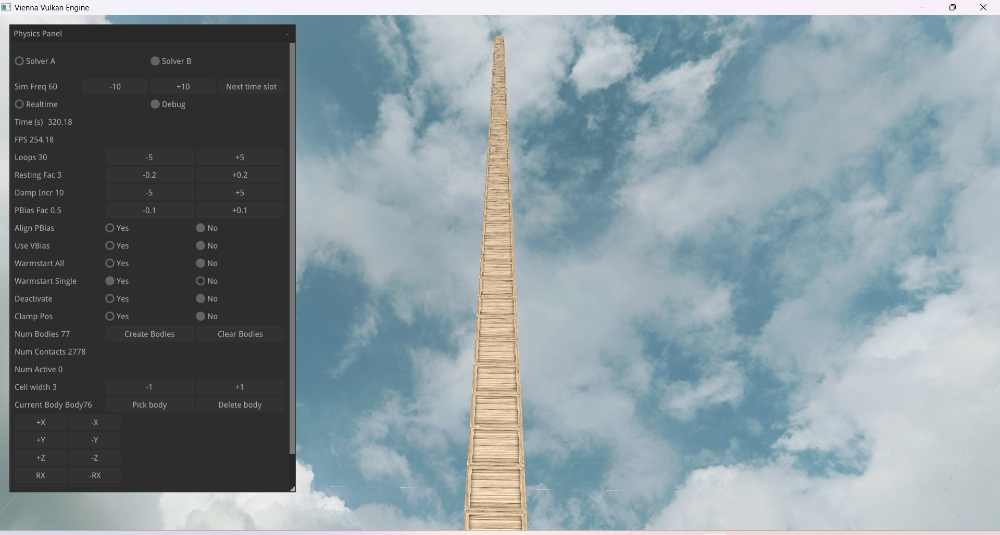

# The Vienna Physics Engine (VPE)
The Vienna Physics Engine (VPE) is a C++23 module-based physics engine for educational purposes.
Rendering can be done by any render engine or framework. The example project provided in this repo uses Vienna Vulkan Engine V3 (https://github.com/hlavacs/ViennaVulkanEngine) for rendering.
If you do not want this then exclude the example from building.

The VPE is developed as basis for game based courses at the Faculty of Computer Science of the University of Vienna, held by Prof. Helmut Hlavacs:

- https://ufind.univie.ac.at/de/course.html?lv=052212&semester=2023W
- https://ufind.univie.ac.at/de/course.html?lv=052211&semester=2023S
- https://ufind.univie.ac.at/de/course.html?lv=052214&semester=2023S

VPE's main contributor is Prof. Helmut Hlavacs (http://entertain.univie.ac.at/~hlavacs/). The parts for general constraints have been implemented by Julian Schneebaur. The softbody simulation was implemented by Felix Neumann.

VPE features are:
- C++23
- Full rigid body simulation, for now for polytopes only
- Sequential impulse based solver
- Implements two solvers to choose from
- Friction
- Contact set reduction
- Warm starting for stable stacking
- Many joint constraints: ball-socket, hinge with angle limits, motor, slider with limits, fixed
- Combined models: bridge, drive train, rag doll

# Set up for Windows 11

The engine is exposed as the `VEPhysicsEngine` C++23 module. The provided example program uses Vienna Vulkan Engine V3 for rendering. On Windows, VVE is built *together with* VPE: the VPE CMake project adds `..\ViennaVulkanEngine` as a subdirectory, so one Ninja build compiles the VVE modules, the VPE module and the example with the same compiler flags (this is required for MSVC C++ modules and `import std`).

- Make sure you have an up to date CMake (>= 3.31.8), MS Visual Studio 2022 or newer (with the "C++ CMake tools" component, which provides Ninja), the Vulkan SDK (`VULKAN_SDK` set), and vcpkg on the PATH.
- Clone the Vienna Vulkan Engine: *git clone https://github.com/hlavacs/ViennaVulkanEngine.git*
- Clone the Vienna Physics Engine into the same directory, next to each other: *git clone https://github.com/hlavacs/ViennaPhysicsEngine.git*
- Cd into Vienna Vulkan Engine and run `build_windows.cmd release` once. This installs VVE's vcpkg dependencies (SDL3, assimp, imgui, glm, ...) into `ViennaVulkanEngine\vcpkg_installed`. VPE reuses that directory.
- Cd into the Vienna Physics Engine directory and run `build_cmake.cmd release` (or `debug`). The script configures with Ninja + MSVC, builds VVE and VPE, and links the example.
- The binary is written to `ViennaVulkanEngine\bin\release\exe\physicsexample.exe` (or `bin\debug\exe`), next to the VVE runtime DLLs and compiled shaders. Run it from there.
- `build_cmake.cmd --without-vve` builds and (with `--tests`) tests only the VPE module; `--clean` wipes the build directory first.

Do **not** generate a Visual Studio solution for this project: the VS generator cannot build `import std`, which VVE requires. Open the folder in Visual Studio or VS Code as a CMake project instead, or use the build script.

On Linux/macOS the example instead links VVE's already-built Clang release tree (see `build_linux.sh`, `build_macos.sh` and `VVE_V3_MIGRATION_NOTES.md`). The CMake option `VPE_VVE_IN_TREE` selects between the two modes; it defaults to ON on Windows and OFF elsewhere.

The project will be updated regularly, so it makes sense to pull the newest version regularly.

# Using VPE

You can use VPE without VVE by linking `ViennaPhysicsEngine::ViennaPhysicsEngine`
and importing its public module:

```cpp
import VEPhysicsEngine;
```

To compile and test VPE on Linux without installing or building VVE, run:

```bash
./build_linux.sh release --without-vve
```

The equivalent direct CMake configuration is:

```bash
cmake -S . -B build/standalone -G Ninja \
  -DVPE_BUILD_EXAMPLES=OFF \
  -DVPE_BUILD_TESTS=ON
cmake --build build/standalone
ctest --test-dir build/standalone --output-on-failure
```

When VPE is added with `add_subdirectory`, consumers link the module target:

```cmake
target_link_libraries(my_app PRIVATE ViennaPhysicsEngine::ViennaPhysicsEngine)
```

The main class is called VPEWorld. This class manages rigid bodies, which themselves must be polytopes, i.e., convex mesh like objects, consisting of faces, edges and vertices. There can be arbitrary numbers of VPEWorld instances at any time. You can create bodies, erase bodies, attach forces to bodies by calling the respective member functions addBody(), eraseBody(), attachForce(). See the examples in physicsexample.cpp.

When created, you can specify a plethora of parameters, like polytope type, mass, velocity, rotation, friction etc. See the constructor of the class Body for more details.
You can also specify two callbacks. One is called when the body moves, so your render engine can update its position and orientation. The other is called if the body is erased by calling eraseBody() or clear(). This way, its pendent in the render engine can be automatically removed as well.
See the functions onMove() ad onErase() in physicsexample.cpp.

The pendent in your render engine is called the owner of the body, and a pointer to it is stored as void pointer with the body. There is a 1:1 correspondence between the owner and a body. An owner can not own more than one body. The void pointer to the owner is the key that is used in the associative container m_bodies to store all bodies and can be used to find using getBody() it or erase it later using eraseBody().
The pointer VPEWorld::m_body always points the latest body created, or a body that was picked with the debug panel option "pick body".

The simulation is advanced by dt seconds calling tick(dt). See how the debug panel works for more options.

# The Debug Panel

physicsexample.cpp contains code that uses ImGui (via the VVE GUI system) to create two debug panels, for plan rigid body simulation and body constraints. The rigid body panel lets you monitor and change many values of the simulation. This is done simply by changing the respective member variables of the VPEWorld instance.

In debug mode, the simulation pauses and can be stepped through manually. This can be mixed with debugging and setting breakpoints, and outputting values.

# Screenshots and Videos

[](https://www.youtube.com/watch?v=OXzVGFwC8dI "")

Video



Random objects falling from above.


Pyramid.


Destroying the pyramid.


Arbitrarily high stack.


## Links
-	https://github.com/hlavacs/ViennaVulkanEngine
